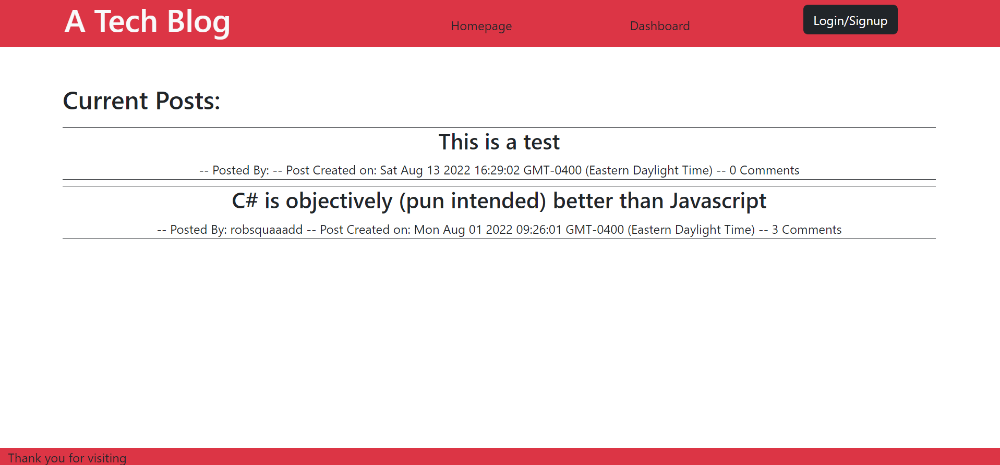
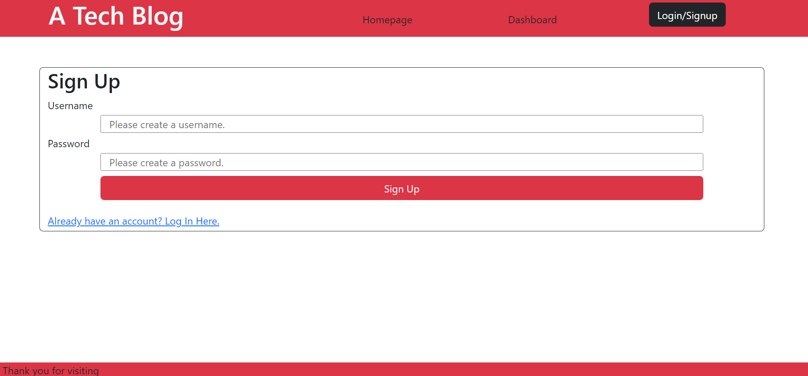
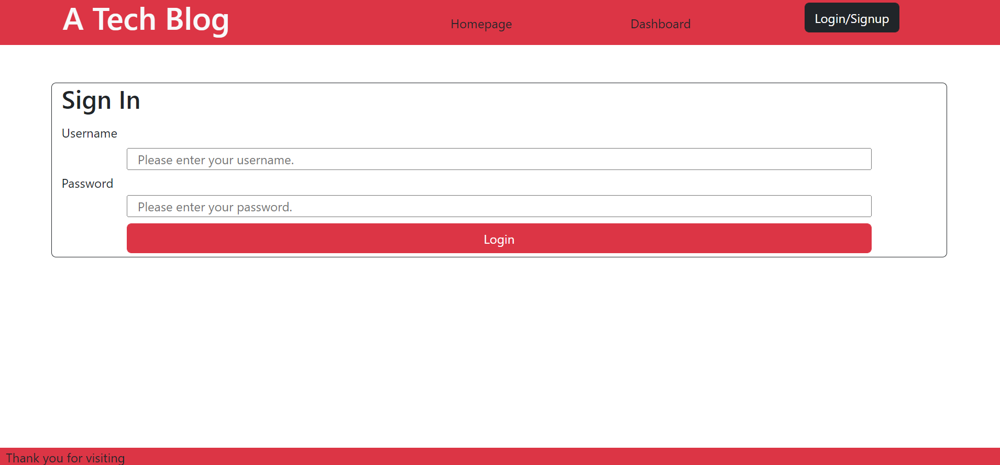
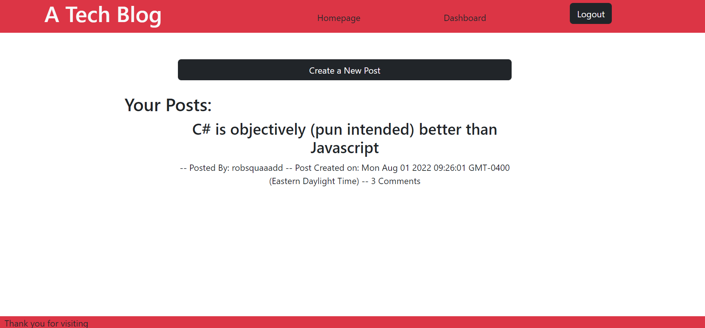
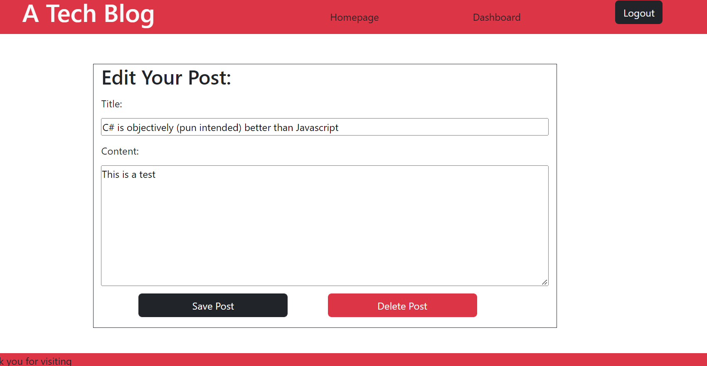
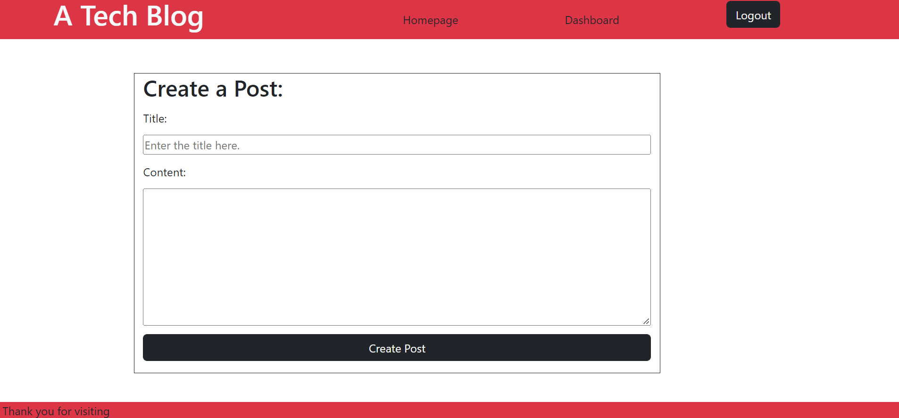

# a-tech-blog

## Description

This application is designed to allow users to post user generated content about technology related subjects.

Users can log in using a username and a password. When logged in, users can create posts, edit posts that they've previously created, delete posts, and view other people's content.

When a user encounters the home page, there is a list of posts listed in descending chronological order. Every page contains a nav bar with links to the home page, the dashboard, and to login or logout depending on if the user is signed in. If the user tries to visit the dashboard when they are not signed in, the site will redirect you to the sign up page.

The sign up page allows users to create an account using a username and password. If a user has an account, they can click the link at the bottom of the sign up form to reach the login form.

When the user is signed in they can comment on other users posts. The comment box will not be available if users are not signed in.

Users can also create posts from the dashboard. When the user accesses the dashboard they can create a post by clicking the create post button and filling out the create post form.

Users can edit or delete posts from their dashboard if they click on one of their posts. That will take them to the edit post page where they can edit or delete a post.

## images

# links

Repo: https://github.com/robsquaadd/a-tech-blog
Link: 
